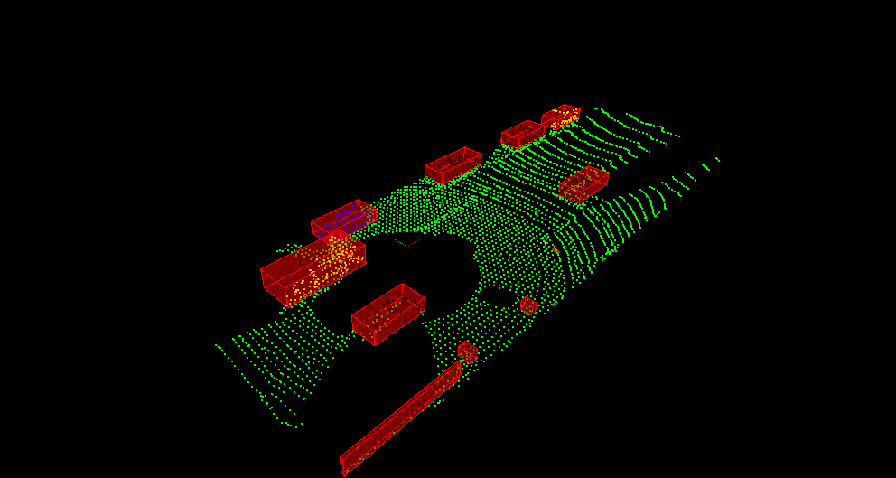

## Udacity Sensor Fusion Nanodegree

## Lidar Obstacle Detection Project

This repository is my solution for the LIDAR Obstacle Detection project of the SFND.
The solution was developed on my own PC rather than on the Udacity remote virtual machines. Prior to submitting the solution was imported into the Udacity environment, built and executed to ensure that it satisfied the requirements.

### Objective

The aim of the project is to:

The solution is implemented in cpp, and ustilises the PCL library for manipulating point clouds. The following components were implemented by myself as specified by the project requirements:

* RANSAC: in order to segment the ground plane from the obstacle point clouds
* KDTree: in order to cluster the points to represent obstacles in the scene
* Euclidean Custering Algorithm

### Output

The executable processes the point cloud data provides, segments the ground plane using RANSAC, and processes the remaining points using euclidean clustering and KDtree.
The points are rendered in various colours to differentiate the objects, with bounding boxes.

### Files

* environment.cpp: loads point cloud data, calls processing functions, renders results
* processPointClouds.cpp/.h: implements main processing methos, including self implemented RANSAC method
* kdtree3d: self implemented KDtree. Based on the learning from the lession, but explanded to handle 3 dimensions.
